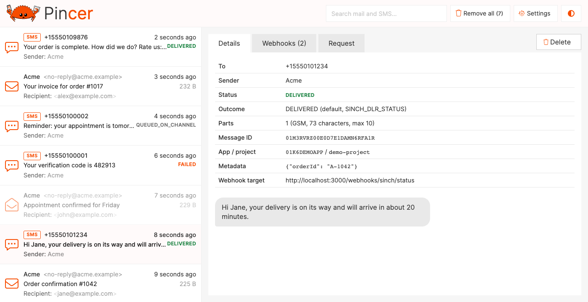

# Pincer

Email and SMS test server for development, written in Rust.

Pincer is a fork of [MailCrab](https://github.com/tweedegolf/mailcrab). Next to the accept-all SMTP server it mocks the [Sinch](https://developers.sinch.com) APIs used to send SMS, so one dev server catches both email and SMS and shows them interleaved in one web interface. See [SMS (Sinch mock)](#sms-sinch-mock).

Inspired by [MailHog](https://github.com/mailhog/MailHog) and [MailCatcher](https://mailcatcher.me/).

MailCrab, which Pincer builds on, was created as an exercise in Rust, trying out [Axum](https://github.com/tokio-rs/axum) and functional components with [Yew](https://yew.rs/), but most of all because it is really enjoyable to write Rust code.

## TLDR

```sh
docker run --rm -p 1080:1080 -p 1025:1025 -p 1090:1090 ghcr.io/installerhq/pincer:latest
```

## Features

- Accept-all SMTP server
- Mock of the Sinch Conversation API (SMS), OAuth2 token endpoint and Sender ID Registrations API, with signed delivery report webhooks
- Delivery outcomes decided by the recipient number, e.g. numbers ending in `0001` fail
- Web interface to view and inspect all incoming email and SMS in one list, and change the SMS settings at runtime
- View formatted mail, download attachments, view headers or the complete raw mail contents
- Single binary
- Runs on all `amd64` and `arm64` platforms using docker
- About a 10 MB docker image



## Related projects

- [CrabAlert](https://github.com/klr/crabalert) is a macOS status bar application that notifies you of incoming messages in MailCrab (email only)

## Technical overview

Both the backend server and the frontend are written in Rust. The backend receives email over an unencrypted connection on a configurable port, and SMS through the Sinch mock on another port. All messages are stored in memory while the application is running. An API exposes all received email (the SMS endpoints are listed under [SMS (Sinch mock)](#sms-sinch-mock)):

- `GET  /api/messages` return all message metadata
- `GET  /api/message/[id]` returns a complete message, given its `id`
- `POST /api/delete/[id]` deletes a message, given its `id`
- `POST /api/delete-all` deletes all messages
- `GET  /api/version` returns version information about the executable
- `GET  /ws` sends an event to each connected client when an email, SMS or sender ID registration is received or updated, e.g. `{"Mail": {...}}`, `{"Sms": {...}}`, `{"Registration": {...}}` or `{"Removed": "id"}`

The frontend initially calls `/api/messages`, `/api/sms`, `/api/registrations` and `/api/sinch` to receive all existing messages and the Sinch mock settings, and then subscribes for new messages and updates using the websocket connection. When opening a message, the `/api/message/[id]` endpoint is used to retrieve the complete message body and raw email.

The backend also accepts a few commands over the websocket, to mark a message as opened, to delete a single message or delete all messages.

## Installation and usage

You can run Pincer using docker. Start Pincer using the following command:

```sh
docker run --rm -p 1080:1080 -p 1025:1025 -p 1090:1090 ghcr.io/installerhq/pincer:latest
```

The image is available for `linux/amd64` and `linux/arm64`.

Open a browser and navigate to [http://localhost:1080](http://localhost:1080) to view the web interface.

There are also (single) binary builds available for Linux (`x86-64`, `arm64`, `armv7`) and macOS (`arm64`), see https://github.com/installerhq/pincer/releases

### Ports

The default SMTP port is 1025, the default HTTP port is 1080 and the default Sinch mock port is 1090. You can configure the ports using environment variables (`SMTP_PORT`, `HTTP_PORT` and `SINCH_PORT`), or by exposing them on different ports using docker:

```sh
docker run --rm -p 3000:1080 -p 2525:1025 -p 3090:1090 ghcr.io/installerhq/pincer:latest
```
  
## Host

You can specify the host address Pincer will listen on for HTTP request using
the `HTTP_HOST` environment variable. In the docker image the default
address is `0.0.0.0`, when running Pincer directly using cargo or a binary, the default is `127.0.0.1`.
The Sinch mock listens on `SINCH_HOST`, which defaults to `HTTP_HOST`.

### TLS

You can enable TLS and authentication by setting the environment variable `ENABLE_TLS_AUTH=true`. Pincer will generate a key-pair and print the self-signed certificate. Any username/password combination is accepted. For example:

```sh
docker run --rm --env ENABLE_TLS_AUTH=true -p 1080:1080 -p 1025:1025 ghcr.io/installerhq/pincer:latest
```

It is also possible to provide your own certificate by mounting a key and a certificate to `/app/key.pem` and `/app/cert.pem`:

```sh
docker run --rm --env ENABLE_TLS_AUTH=true -v key.pem:/app/key.pem:ro -v cert.pem:/app/cert.pem:ro -p 1080:1080 -p 1025:1025 ghcr.io/installerhq/pincer:latest
```

### Path prefix

You can configure a prefix path for the web interface by setting and environment variable named `MAILCRAB_PREFIX`, for example:

```sh
docker run --rm --env MAILCRAB_PREFIX=emails -p 1080:1080 -p 1025:1025 ghcr.io/installerhq/pincer:latest
```

The web interface will also be served at [http://localhost:1080/emails/](http://localhost:1080/emails/)

### Reverse proxy

See [the reverse proxy guide](./reverse_proxy.md).

### Retention period

By default messages will be stored in memory until Pincer is restarted. This might cause an OOM when Pincer lives
long enough and receives enough messages.

By setting `MAILCRAB_RETENTION_PERIOD` to a number of seconds, messages older than the provided duration will
be cleared. This applies to email and SMS.

### Performance

Pincer is fast, although there is a bottleneck in the throughput of the websocket connection
(between the server and the browser). If there are many messages sent at once (more than 100 per second)
a client can lag behind and messages can get lost. When dealing with many messages at once,
increasing the internal queue size can help to prevent losing messages.
Use the `QUEUE_CAPACITY` environment variable to set the queue size. De default
is 32, which means that Pincer can handle 32 emails if they are all sent at the same time. SMS and their delivery reports use a separate queue of at least 1024 events.

### docker compose

Usage in a `docker-compose.yml` file:

```yml
version: '3.8'
services:
  pincer:
    image: ghcr.io/installerhq/pincer:latest
    #        environment:
    #            ENABLE_TLS_AUTH: true # optionally enable TLS for the SMTP server
    #            MAILCRAB_PREFIX: emails # optionally prefix the webinterface with a path
    #        volumes:
    #           key.pem:/app/key.pem:ro # optionally provide your own keypair for TLS, else a pair will be generated
    #           cert.pem:/app/cert.pem:ro
    #            SINCH_WEBHOOK_URL: http://host.docker.internal:3000/webhooks/sinch/status
    #            SINCH_WEBHOOK_SECRET: secret
    ports:
      - '1080:1080'
      - '1025:1025'
      - '1090:1090'
    networks: [default]
```

## SMS (Sinch mock)

Pincer runs a mock of the Sinch APIs on a separate port (`SINCH_PORT`, default 1090). SMS sent through it show up in the web interface next to email, and Pincer sends Sinch style delivery reports back to your application.

Mocked endpoints:

| Endpoint | Sinch API |
|---|---|
| `POST /oauth2/token` | OAuth2 client credentials (`auth.sinch.com`), returns a JWT shaped token |
| `POST /v1/projects/{project_id}/messages:send` | Conversation API, returns `{message_id, accepted_time}` |
| `GET /v1/projects/{project_id}/markets/availability` | Registrations API |
| `GET /v1/projects/{project_id}/markets/details` | Registrations API (`GB` asks a question before resolving to a policy) |
| `GET /v1/projects/{project_id}/policies/{policy_id}` | Registrations API |
| `GET /v1/projects/{project_id}/policies/{policy_id}/attachments/{attachment_id}/template` | Registrations API |
| `POST /v1/projects/{project_id}/registrations` | Registrations API |
| `GET`, `DELETE /v1/projects/{project_id}/registrations/{id}` | Registrations API |
| `POST /v1/projects/{project_id}/registrations/{id}/attachments/{attachment_id}` | Registrations API |

Any credentials are accepted, but requests without an `Authorization` header are rejected with a 401 like Sinch would. Unknown endpoints return a 404 and are logged.

Point the Sinch SDK at Pincer by overriding its hostnames, for example with `@sinch/sdk-core`:

```js
new SinchClient({
  projectId, keyId, keySecret,
  authHostname: 'http://localhost:1090',
  conversationHostname: 'http://localhost:1090',
});
```

Raw HTTP clients use `http://localhost:1090/oauth2/token` as token URL and `http://localhost:1090` as Registrations API base URL.

### Delivery reports

After a message is accepted Pincer sends a `MESSAGE_DELIVERY` callback with status `QUEUED_ON_CHANNEL`, followed by one final status. Like at Sinch, nothing is reported after the final status.

The recipient number decides the outcome, so failures can be tested from the application itself:

| Recipient ends in | Reports |
|---|---|
| `0001`, e.g. `+4791230001` | `QUEUED_ON_CHANNEL`, then `FAILED` (reason code `406`) |
| `0002`, e.g. `+4791230002` | `QUEUED_ON_CHANNEL`, then nothing: the message stays pending |
| anything else | `QUEUED_ON_CHANNEL`, then `SINCH_DLR_STATUS` (`DELIVERED`) |

Only digits are compared, so formatting does not matter. The rules are configured with `SINCH_DLR_RULES` as comma separated `suffix=OUTCOME` pairs, where the outcome is `DELIVERED`, `READ`, `FAILED` or `PENDING`. The longest matching suffix wins, a full number is a valid suffix, and an empty value disables the rules.

Use numbers that your application considers valid mobile numbers, applications often skip landlines and dummy numbers before calling Sinch.

 The `message_metadata` of the request is echoed as `message_delivery_report.metadata`. Callbacks go to the message `callback_url` when set, otherwise to `SINCH_WEBHOOK_URL`. When `SINCH_WEBHOOK_SECRET` is set, callbacks are signed like Sinch does (`x-sinch-webhook-signature` headers, base64 HMAC-SHA256 over `body.nonce.timestamp`), so the SDK's `ConversationCallbackWebhooks` validates them.

In the web interface each SMS shows its status, its outcome and why, and the webhooks sent with their response. While a message has no final status yet, for example one held by the `PENDING` rule, the web interface offers to send the final report (`DELIVERED` or `FAILED`), once.

Sender ID registrations appear in the list as well. Their status can be changed from the web interface until it is `APPROVED` or `REJECTED`, which sends a `REGISTRATION_STATUS_CHANGE` callback to the registration `callbackUrl` or `SINCH_REGISTRATION_WEBHOOK_URL`, signed with a hex HMAC-SHA1 of the body in `X-Sinch-Signature` when `SINCH_REGISTRATION_HMAC_SECRET` is set. Registrations for a GB policy start in `PENDING_ATTACHMENTS` and move to `IN_QUEUE` once an attachment is uploaded.

### Configuration

The environment variables below set the defaults. The **Settings** button in the web interface changes the delivery report outcomes, rules, delay, webhook URLs and secrets at runtime. Changes apply to SMS sent afterwards, are shared by all open tabs, and last until Pincer restarts.

| Variable | Default | Description |
|---|---|---|
| `SINCH_PORT` | `1090` | Port of the Sinch mock |
| `SINCH_HOST` | `HTTP_HOST` | Host of the Sinch mock |
| `SINCH_WEBHOOK_URL` | | Default target for delivery reports, e.g. `http://host.docker.internal:3000/webhooks/sinch/status` |
| `SINCH_WEBHOOK_SECRET` | | Secret to sign delivery reports, unsigned when empty |
| `SINCH_DLR_DELAY_MS` | `1000` | Delay before each automatic delivery report |
| `SINCH_DLR_STATUS` | `DELIVERED` | Outcome for recipients without a matching rule: `DELIVERED`, `READ`, `FAILED` or `PENDING` to finalize from the web interface |
| `SINCH_DLR_RULES` | `0001=FAILED,0002=PENDING` | Outcomes by recipient suffix, see [delivery reports](#delivery-reports) |
| `SINCH_REGISTRATION_WEBHOOK_URL` | | Default target for registration callbacks |
| `SINCH_REGISTRATION_HMAC_SECRET` | | Secret to sign registration callbacks, unsigned when empty |

Invalid values from the environment are ignored with a warning in the log, e.g. a webhook URL without `http://`, an unknown outcome or a malformed rule. Pincer stops with exit code 1 when one of its ports, including `SINCH_PORT`, is already in use.

SMS respect `MAILCRAB_RETENTION_PERIOD` like email, sender ID registrations are kept until they are deleted.

### Limitations

- Only the Sinch APIs listed above are mocked, e.g. not the SMS REST API (`/xms/v1/...`), inbound messages or the Verification API.
- `SMS_MAX_NUMBER_OF_MESSAGE_PARTS` is shown but not enforced, real Sinch rejects longer messages.
- Webhooks are sent once, failed deliveries are not retried like Sinch does, but they are listed with their error in the web interface.
- Deleting a sender ID registration in the web interface also removes it from the mocked API.

The web interface uses these endpoints on the HTTP port:

- `GET  /api/sms` returns all SMS
- `POST /api/sms/[id]/status/[status]` sends the final delivery report (`DELIVERED`, `READ` or `FAILED`) of a pending SMS, `409` when it already has one
- `GET  /api/registrations` returns all sender ID registrations
- `POST /api/registration/[id]/status/[status]` changes the status of a registration, `409` once it is `APPROVED` or `REJECTED`
- `GET  /api/sinch` returns the Sinch mock configuration and settings
- `PUT  /api/sinch/settings` changes the settings, `400` with a message when they are invalid

## Kubernetes deployment

To deploy Pincer to a Kubernetes cluster, you can use [Helm Chart](./charts/mailcrab/) by cloning this repository and running:

```sh
helm install mailcrab ./charts/mailcrab -f values.yaml
```

For more information on configuring the Helm Chart, see the chart [README](./charts/mailcrab/README.md).

## Sample messages

The `samples` directory contains a couple of test messages. These can be sent using by running:

```sh
cd backend/
cargo test send_sample_messages -- --ignored
```

Alternatively you can send messages using curl:

```sh
curl smtp://127.0.0.1:1025 --mail-from myself@example.com --mail-rcpt receiver@example.com --upload-file samples/normal.email
# with tls
curl -k --ssl-reqd smtps://127.0.0.1:1025 --mail-from myself@example.com --mail-rcpt receiver@example.com --upload-file samples/normal.email --user 'user:pass'
```

## Development

Install [Rust](https://www.rust-lang.org/learn/get-started) and [Trunk](https://trunk-rs.github.io/trunk/)

```sh
# Add wasm as target if it it not present after following the install instructions for Trunk
rustup target add wasm32-unknown-unknown

# clone the code
git clone git@github.com:installerhq/pincer.git

# start the backend
cd backend
cargo run

# serve the frontend (in a new terminal window)
cd ../frontend
trunk serve

# optionally send test messages in an interval
cd ../backend
cargo test
```
